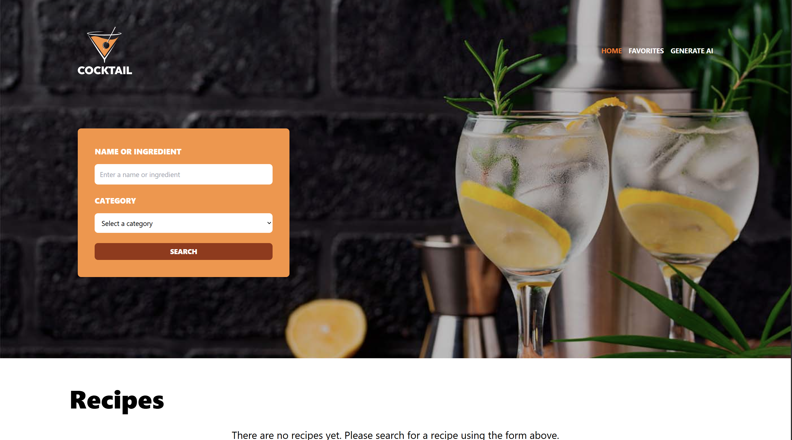

# Cocktail Recipe Explorer 🍹

A React-based web application for discovering, saving, and generating cocktail recipes using TheCocktailDB API and AI-powered recipe generation via OpenRouter.

 

## Features
- 🧾 Search cocktail recipes with TheCocktailDB API
- 🖼️ View recipe details with ingredients and preparation steps
- 🌟 Add/remove favorites with persistent local storage
- 🤖 AI-generated cocktail recipes using OpenRouter's models
- 💬 Interactive notifications for user actions
- 🚀 Responsive design with modern UI components

## Installation
1. Clone repository:
```bash
git clone https://github.com/yourusername/cocktail-explorer.git
cd cocktail-explorer
```

2. Install dependencies:
```bash
npm install
```

3. Create .env file in root directory:
```bash
VITE_OPENROUTER_KEY=your_api_key_here
```

Technologies Used
⚛️ React + TypeScript

⚡ Vite

🟣 Redux Toolkit (State Management)

🐍 Zod (Schema Validation)

🤖 OpenRouter (AI Models)

📡 Axios (HTTP Client)

🎨 Tailwind CSS (Styling)

Project Structure:
```bash
src/
├── components/       # Reusable components
├── services/         # API service handlers
├── stores/           # Redux store and slices
├── types/            # TypeScript definitions
├── utils/            # Utility functions and schemas
├── views/            # Page components
├── main.tsx          # App entry point
└── router.tsx        # Routing configuration
```

Environment Variables

Variable	Description
```bash
VITE_OPENROUTER_KEY	API key for OpenRouter AI services
```

Contributing
Contributions are welcome! Please follow these steps:

Fork the project

Create your feature branch (git checkout -b feature/amazing-feature)

Commit your changes (git commit -m 'Add some amazing feature')

Push to the branch (git push origin feature/amazing-feature)

Open a Pull Request